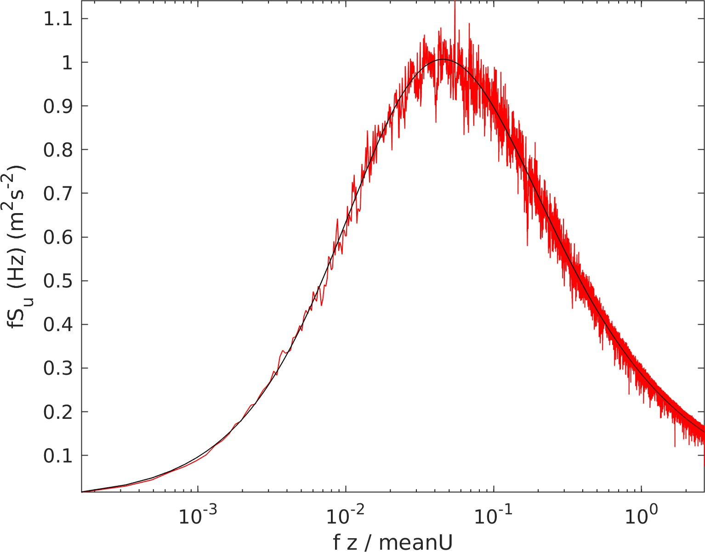

# randomProcess
Minimalist Matlab implementation of a random process generation in one point

## Summary
A stationary Gaussian random process is generated using the spectral method. This means that the function requires only two inputs: the target power spectral density (PSD) and the associated frequency vector.

## Content
The present submission contains:
 - The function randomProcess.m, which generates the (random) time series associated with a target PSD
 - An example file Documentation.mlx, which illustrates the generation of the random process using the case of atmospheric turbulence
- The function getSamplingPara.m, which computes the target frequency vector and the associated time vector.

Any question, suggestion or comment is welcome.

## Example

